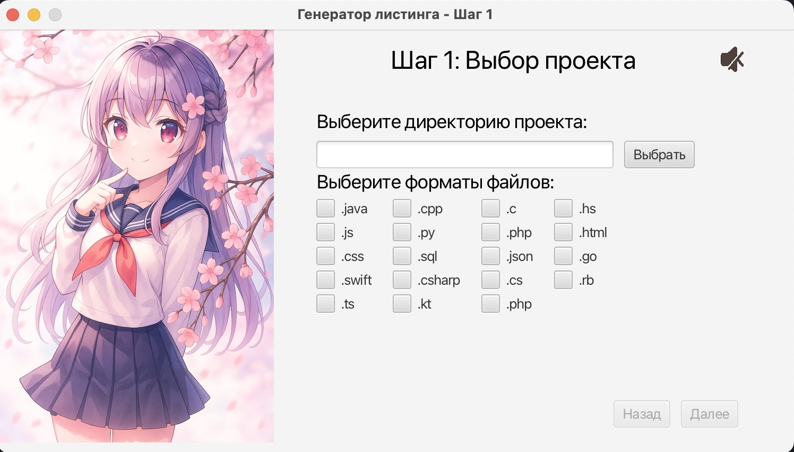
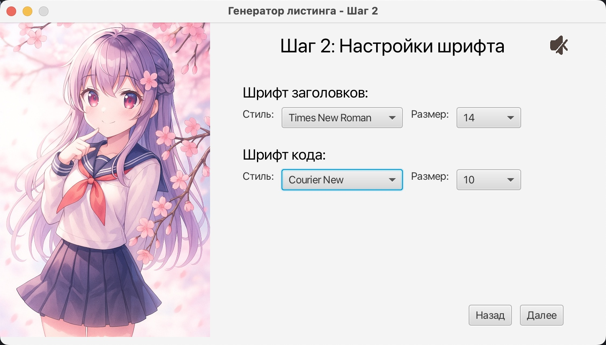

# listing-generator
## Описание
Программа позволяет создавать документы .docx, в которых представлены названия файлов с расширениями .java, .cpp, .c, .hs, .js, .py, .php и другими и содержимое этих файлов. Стили и размер шрифта выбираются.

Используемые технологии: Java SE, JavaFX, Apache POI, Maven.

Полный список расширений файлов с программным кодом: .java, .cpp, .c, .hs, .js, .py, .php, .html, .css, .sql, .json, .go, .swift, .csharp, .cs, .rb, .ts, .kt, .php.

Для пользователя доступны следующие действия:
- Выбор директории, содержащей файлы с кодом для формирования документа

- Выбор директории, куда будет сохраняться документ

- Ввод имени для документа, который будет сгенерирован

- Запуск генерации документа

- Включение и выключение музыки

## Инструкция по использованию:

1. Распакуйте архив (listing-windows-x64.zip)

2. В полученной папке запустите listing.exe

3. В открывшемся окне выберите директорию с файлами, содержащими программный код. Выберите расширения файлов, которые должны быть включены в документ. Нажмите кнопку "Далее".

4. При желании измените шрифты для заголовков и текста кода. Нажмите кнопку "Далее".

5. Введите корректное имя для документа .docx, выберите директорию для сохранения.

5. Нажмите кнопку "Готово" для генерации листинга.

6. Файл будет создан в папке с исполняемой программой или по указанной директории.
